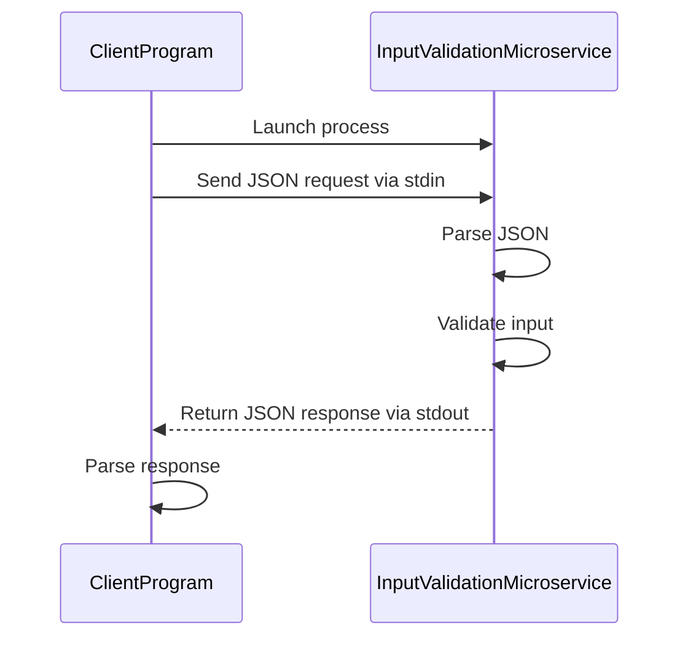

Input Validation Microservice
Description:

The Input Validation Microservice validates and optionally normalizes user input.
It is designed to be reusable and independent from any specific application. Any local program can call this service to validate:

-Selection-based inputs (numeric or text)
-General text inputs (non-empty validation)

The microservice runs locally and communicates using JSON over standard input and output (stdin/stdout).

Additionally, this service:

-Does not store data
-Does not depend on any specific main program
-Can be reused by any teammate’s application

Communication Contract:

JSON request via stdin
JSON response via stdout

Example Request (in Python)

import subprocess
import json

request_data = {
    "input_value": "2",
    "allowed_values": ["Paladin", "Rogue", "Cleric"],
    "input_type": "selection",
    "normalize": True
}

process = subprocess.Popen(
    ["python", "InputValidationMicroservice.py"],
    stdin=subprocess.PIPE,
    stdout=subprocess.PIPE,
    text=True
)

stdout, _ = process.communicate(json.dumps(request_data))
response = json.loads(stdout)

print(response)

Example JSON request sent to the microservice

{
  "input_value": "2",
  "allowed_values": ["Paladin", "Rogue", "Cleric"],
  "input_type": "selection",
  "normalize": true
}

Receiving Data from the Microservice 

Response Data Type
JSON object returned via stdout.

Example of a Valid Response

{
  "is_valid": true,
  "normalized_value": "Rogue",
  "message": "Input is valid."
}

Example of an Invalid Response

{
  "is_valid": false,
  "normalized_value": null,
  "message": "Invalid input."
}

UML Sequence Diagram

